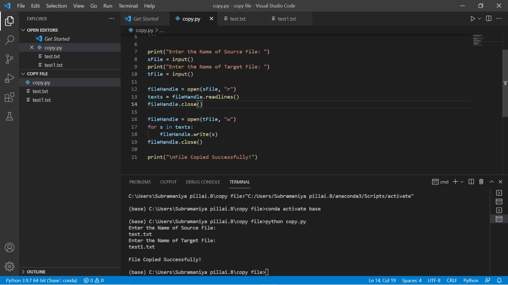

# copy-file
## AIM:
To write a python program for copying the contents from one file to another file.
## EQUIPEMENT'S REQUIRED: 
PC
Anaconda - Python 3.7
## ALGORITHM: 
### Step 1:
Create a txt file and write  the content u wish [lines.txt] 

### Step 2: 
 create another empty file to copy the content from the first file 
### Step 3: 
Use write() function to copy the content from [line.txt] to empty file , [text.txt].
### Step 4:  
run the terminal with py extension 
### Step 5: 
The text from the [lines.txt] fine is copied to the empty file [text.txt]. 
### Step 6: 
close the program
## PROGRAM:
#### PROGRAM FOR COPYING THE CONTENTS
#### Developed by: SUBRAMANIYA PILLAI.B
#### RegisterNumber: 21006076

```
print("Enter the Name of Source File: ")
sFile = input()
print("Enter the Name of Target File: ")
tFile = input()

fileHandle = open(sFile, "r")
texts = fileHandle.readlines()
fileHandle.close()

fileHandle = open(tFile, "w")
for s in texts:
    fileHandle.write(s)
fileHandle.close()

print("\nFile Copied Successfully!")
```

### OUTPUT:



## RESULT:
Thus the program is written to copy the contents from one file to another file.